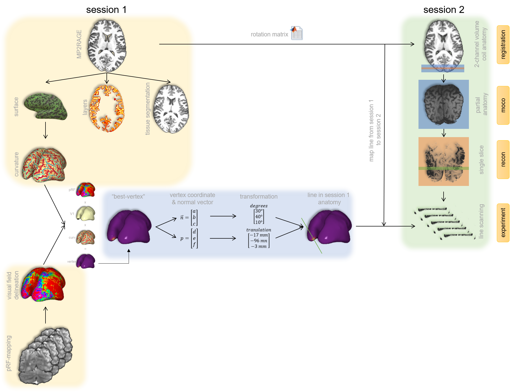

.. linescanning documentation master file
.. fmriprep documentation master file, created by
   sphinx-quickstart on Mon May  9 09:04:25 2016.
   You can adapt this file completely to your liking, but it should at least
   contain the root `toctree` directive.

.. include:: links.rst

Welcome to the linescanning repository
===========================================

This repository contains all of the tools used during the acquisition and postprocessing of line scanning data at the Spinoza Centre for Neuroimaging in Amsterdam. The main goal of the package is to create the most accurate segmentations (both volumetric and surface) by combining various software packages such as Nighres_, fMRIprep_, FreeSurfer_, CAT12_, and SPM_. 

Contents
--------

.. toctree::
   :maxdepth: 3
   :caption: Getting started

   installation
   usage

.. toctree::
   :maxdepth: 1
   :caption: Example gallery

   examples/lazyplot
   examples/genericglm
   examples/nideconv
   examples/acompcor
   
.. toctree::
   :maxdepth: 2
   :caption: Reference

   bash
   classes/index